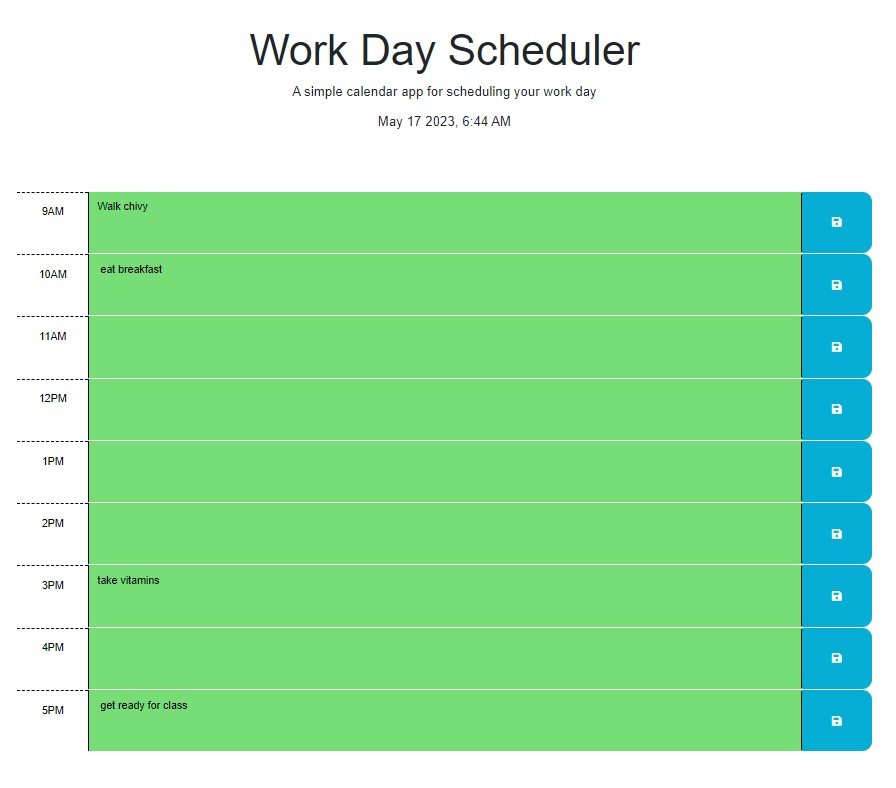

# BusyBeeSchedule

## Description

This app was a clone assignment. Which was updated using Javascript for less codes in HTML with a little bit of JQuery added. The code now used makes the vs code look simple and clean. The app is updated with current time showing all grey after 5pm meaning it is past. It has a current date at the header which is JQuery date format showing current date and time. The scheduler was updated with JavaScript so that the user can save information in each hour section. You can also refresh the page and see that the scheduler will still have what you entered. If the user would like to add something else in the hour section they will be able to and store again.

## Installation

There are no installations for this assignment.

## Usage

## Links

[deployed site](https://lexxvasquez.github.io/BusyBeeSchedule/)

[Github](https://github.com/Lexxvasquez/BusyBeeSchedule)

